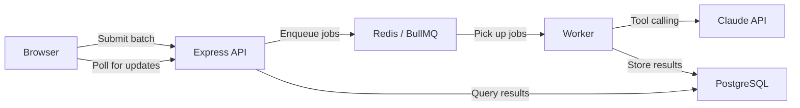

# AI Content Pipeline — Application Summary

## What Is It?

AI Content Pipeline is a batch content processing system powered by Claude AI. Submit URLs or raw text in batches, and the app asynchronously analyzes each item using Claude's tool-calling API to generate structured summaries and key points. Results are delivered through a real-time polling interface as each item completes.

---

## What It Does

- **Batch submission** — submit up to 50 URLs or text snippets in a single batch
- **Async processing** — items are queued via BullMQ and processed by a dedicated worker, so the API stays fast
- **AI-powered summarization** — Claude analyzes each item and calls a structured `summarize` tool to produce a summary and key takeaways
- **Real-time progress** — the dashboard polls for updates every 3 seconds while batches are processing, showing live status for each item
- **Automatic retries** — failed items are retried up to 3 times with exponential backoff before being marked as failed

---

## User Flows

### 1. Creating an Account

1. Open the app — you'll see a login/register form
2. Choose **Register**, enter your email and a password (min 8 characters), and click **Register**
3. You're logged in immediately and taken to your dashboard

### 2. Logging In

1. Open the app
2. Enter your email and password, then click **Log In**
3. You're taken to your dashboard with all your previous batches

### 3. Submitting a Batch

1. On the dashboard, you'll see the **batch submission form** at the top
2. Click **Add Item** to add content to your batch
3. For each item, toggle between **URL** or **Text** input:
   - **URL**: paste a link to any article, blog post, or web page
   - **Text**: paste or type raw text content (up to 8,000 characters)
4. Add as many items as you need (up to 50 per batch)
5. Click **Submit Batch** — your batch appears in the list below with a "Pending" status

### 4. Watching Processing Progress

1. After submitting, your batch moves from **Pending** to **Processing**
2. A progress bar shows how many items have completed
3. Individual items show their status: Queued, Processing, Complete, or Failed
4. The page automatically refreshes every 3 seconds — no need to manually reload

### 5. Viewing Results

1. Click on any batch to see its detail page
2. Each completed item shows:
   - **Summary** — a 2-4 sentence overview of the content
   - **Key Points** — 3-5 bullet point takeaways displayed as tags
   - **Input preview** — the URL or text you submitted
3. Failed items show an error message explaining what went wrong
4. Use the **Back to Dashboard** link to return to your batch list

### 6. Filtering Batches

1. On the dashboard, use the filter tabs to view batches by status
2. Filter options: **All**, **Pending**, **Processing**, **Complete**, **Failed**
3. Batches are sorted by creation date (newest first)

---

## Key Behaviors

- **URL processing**: the worker fetches the web page, extracts the article text (stripping ads, navigation, and scripts), and sends the clean text to Claude for analysis
- **Text processing**: raw text is sent directly to Claude (truncated to 8,000 characters if longer)
- **Batch status**: automatically transitions from `pending` → `processing` → `complete` (or `failed` if all items fail)
- **Session persistence**: your login session lasts 7 days — you won't need to re-authenticate unless you log out or the session expires
- **Rate limiting**: the worker processes up to 10 items per minute and 3 items concurrently, ensuring reliable throughput without overwhelming the AI API

---

## Architecture at a Glance

The system uses three independent services: the **API server** handles requests and manages data, the **worker** processes queued items asynchronously, and the **Next.js frontend** provides the user interface. Redis connects the API to the worker via BullMQ job queues, and PostgreSQL stores all persistent data.
