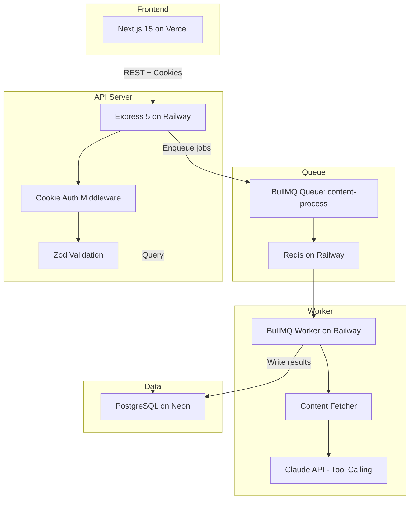
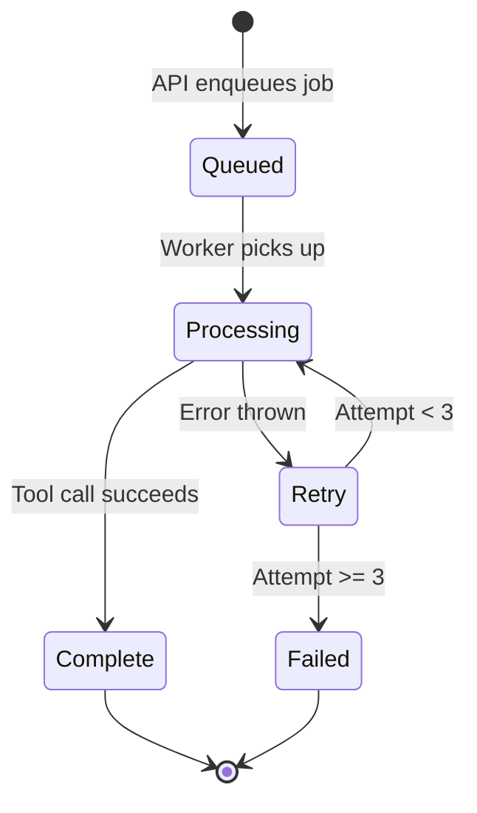

# AI Content Pipeline — Technical Overview

## Table of Contents

1. [Project Context](#1-project-context)
2. [Architecture Overview](#2-architecture-overview)
3. [Tech Stack](#3-tech-stack)
4. [Repository Structure](#4-repository-structure)
5. [Database Schema](#5-database-schema)
6. [API Reference](#6-api-reference)
7. [System Design Deep Dives](#7-system-design-deep-dives)
   - [BullMQ Job Queue](#71-bullmq-job-queue)
   - [Claude Tool Calling](#72-claude-tool-calling)
   - [Content Extraction](#73-content-extraction)
   - [Authentication](#74-authentication)
8. [Middleware Stack](#8-middleware-stack)
9. [Frontend Architecture](#9-frontend-architecture)
10. [Deployment](#10-deployment)
11. [Architectural Decisions](#11-architectural-decisions)

---

## 1. Project Context

This is App 3 in a portfolio of eight progressive full-stack AI applications. Its primary purpose is to demonstrate **tool calling (function calling)** with the Anthropic Claude API combined with **asynchronous job processing** via BullMQ. The tool-calling pattern introduced here becomes the foundation for the agentic loop in App 8.

The application is a production-grade batch content processing pipeline where submitted URLs and text are analyzed by an LLM worker.

---

## 2. Architecture Overview



**Three services run independently:**

- **API Server** — handles HTTP requests, manages sessions, enqueues jobs
- **Worker** — pulls jobs from Redis, processes content with Claude, writes results to PostgreSQL
- **Frontend** — Next.js app that provides the UI and polls for updates

---

## 3. Tech Stack

| Layer    | Technology                                 | Purpose                        |
| -------- | ------------------------------------------ | ------------------------------ |
| Frontend | Next.js 15, React 19, TanStack React Query | SSR, client state, polling     |
| Styling  | SCSS Modules, CSS Custom Properties        | Component-scoped styles        |
| API      | Express 5, TypeScript, Zod                 | REST API, validation           |
| Queue    | Redis, BullMQ 5                            | Job queue, rate limiting       |
| Worker   | Node.js, @anthropic-ai/sdk                 | Job processing, Claude API     |
| Database | PostgreSQL (Neon), node-pg-migrate         | Persistent storage, migrations |
| Auth     | Cookie sessions, bcrypt                    | Session-based authentication   |
| Content  | @extractus/article-extractor               | URL text extraction            |

---

## 4. Repository Structure

```
async-ai-content-pipeline/
├── server/                    # Express API
│   ├── src/
│   │   ├── app.ts             # Express setup & middleware
│   │   ├── index.ts           # Server entry point
│   │   ├── handlers/          # Route handlers (auth, batches)
│   │   ├── routes/            # Express routers
│   │   ├── middleware/        # Auth, CORS, errors, rate limiting
│   │   ├── repositories/     # Data access layer
│   │   ├── schemas/          # Zod validation schemas
│   │   ├── config/           # Redis, queue, secrets, CORS
│   │   ├── db/               # PostgreSQL pool
│   │   └── utils/            # Logging (pino)
│   └── migrations/           # SQL migrations (node-pg-migrate)
│
├── worker/                    # BullMQ job processor
│   ├── src/
│   │   ├── workers.ts         # Worker setup & lifecycle
│   │   ├── processors/       # Job handler (content-processor)
│   │   ├── services/         # Content fetching
│   │   ├── prompts/          # Tool definitions & system prompt
│   │   ├── db/               # Database connection
│   │   └── config/           # Secrets
│   └── package.json
│
├── web-client/                # Next.js frontend
│   ├── src/
│   │   ├── app/              # App Router pages
│   │   ├── components/       # React components
│   │   ├── lib/              # API client, auth context
│   │   ├── providers/        # React Query provider
│   │   └── types/            # TypeScript interfaces
│   └── package.json
│
└── docs/                      # Documentation (this file)
```

---

## 5. Database Schema

Four tables managed by `node-pg-migrate` migrations:

### `users`

| Column          | Type        | Notes                          |
| --------------- | ----------- | ------------------------------ |
| `id`            | UUID        | Primary key, gen_random_uuid() |
| `email`         | TEXT        | Unique                         |
| `password_hash` | TEXT        | bcrypt, 12 rounds              |
| `created_at`    | TIMESTAMPTZ | Default NOW()                  |
| `updated_at`    | TIMESTAMPTZ | Auto-updated via trigger       |

### `sessions`

| Column       | Type        | Notes                                  |
| ------------ | ----------- | -------------------------------------- |
| `id`         | TEXT        | Primary key — SHA256 hash of raw token |
| `user_id`    | UUID        | FK → users (CASCADE)                   |
| `expires_at` | TIMESTAMPTZ | 7-day TTL                              |
| `created_at` | TIMESTAMPTZ | Default NOW()                          |

### `batches`

| Column            | Type        | Notes                                            |
| ----------------- | ----------- | ------------------------------------------------ |
| `id`              | UUID        | Primary key                                      |
| `user_id`         | UUID        | FK → users                                       |
| `status`          | VARCHAR(50) | `pending` / `processing` / `complete` / `failed` |
| `total_items`     | INTEGER     | Count of items in batch                          |
| `completed_items` | INTEGER     | Items with status `complete`                     |
| `failed_items`    | INTEGER     | Items with status `failed`                       |
| `created_at`      | TIMESTAMPTZ | Default NOW()                                    |
| `completed_at`    | TIMESTAMPTZ | Nullable — set when all items finish             |
| `updated_at`      | TIMESTAMPTZ | Auto-updated via trigger                         |

### `batch_items`

| Column           | Type        | Notes                                           |
| ---------------- | ----------- | ----------------------------------------------- |
| `id`             | UUID        | Primary key                                     |
| `batch_id`       | UUID        | FK → batches                                    |
| `input_type`     | VARCHAR(10) | `url` or `text`                                 |
| `input_url`      | TEXT        | Nullable — populated for URL items              |
| `input_text`     | TEXT        | Nullable — populated for text items             |
| `status`         | VARCHAR(50) | `queued` / `processing` / `complete` / `failed` |
| `classification` | JSONB       | Nullable — flexible schema                      |
| `entities`       | JSONB       | Nullable — flexible schema                      |
| `tags`           | TEXT[]      | Array of extracted tags                         |
| `summary`        | TEXT        | Nullable — AI-generated summary                 |
| `error`          | TEXT        | Nullable — error message on failure             |
| `attempts`       | INTEGER     | Processing attempt count (max 3)                |
| `processed_at`   | TIMESTAMPTZ | Nullable — set on completion                    |
| `created_at`     | TIMESTAMPTZ | Default NOW()                                   |
| `updated_at`     | TIMESTAMPTZ | Auto-updated via trigger                        |

---

## 6. API Reference

### Authentication — `/auth`

| Method | Path             | Auth | Body                | Response                          |
| ------ | ---------------- | ---- | ------------------- | --------------------------------- |
| POST   | `/auth/register` | No   | `{email, password}` | 201: `{user}` + sets `sid` cookie |
| POST   | `/auth/login`    | No   | `{email, password}` | 200: `{user}` + sets `sid` cookie |
| POST   | `/auth/logout`   | No   | —                   | 204: clears `sid` cookie          |
| GET    | `/auth/me`       | Yes  | —                   | 200: `{user}`                     |

### Batches — `/batches` (all authenticated)

| Method | Path                 | Body / Params                    | Response                              |
| ------ | -------------------- | -------------------------------- | ------------------------------------- |
| POST   | `/batches`           | `{items: [{type, url?, text?}]}` | 201: `{batch, items}` — enqueues jobs |
| GET    | `/batches`           | `?limit=10&offset=0`             | 200: `{data: batches[], meta}`        |
| GET    | `/batches/:id`       | —                                | 200: `{data: batch}`                  |
| GET    | `/batches/:id/items` | `?limit=10&offset=0`             | 200: `{data: items[], meta}`          |

**Validation rules:**

- 1–50 items per batch
- URL items require a valid URL
- Text items: 1–8,000 characters

---

## 7. System Design Deep Dives

### 7.1 BullMQ Job Queue

The queue decouples the API from AI processing, enabling horizontal scaling and built-in retry logic.

**Queue configuration:**

```typescript
{
  name: 'content-process',
  concurrency: 3,               // 3 simultaneous jobs per worker
  limiter: { max: 10, duration: 60_000 },  // 10 jobs/minute
  defaultJobOptions: {
    attempts: 3,
    backoff: { type: 'exponential', delay: 5000 },
    removeOnComplete: { count: 1000 },
    removeOnFail: { count: 5000 },
  }
}
```

**Job lifecycle:**



**Job data shape:**

```typescript
{
  itemId: string; // batch_items.id
  batchId: string; // batches.id
  inputType: 'url' | 'text';
  inputUrl: string | null;
  inputText: string | null;
}
```

### 7.2 Claude Tool Calling

This app uses **single-pass tool calling** — Claude receives the content and is instructed to call the `summarize` tool exactly once. This is distinct from the multi-turn agentic loop in App 8.

**Tool definition:**

```typescript
{
  name: 'summarize',
  description: 'Generate a concise summary of the given content.',
  input_schema: {
    type: 'object',
    properties: {
      summary: {
        type: 'string',
        description: 'A concise summary, 2-4 sentences covering key points'
      },
      key_points: {
        type: 'array',
        items: { type: 'string' },
        description: '3-5 bullet point key takeaways'
      }
    },
    required: ['summary', 'key_points']
  }
}
```

**System prompt:**

> You are a content analysis assistant. You will be given content (either from a URL or raw text) and must analyze it using the available tools. For the content provided, call the summarize tool to generate a structured summary. Always call at least one tool. Do not respond with plain text — use the tools to structure your analysis.

**Processing flow:**

1. Worker sends content + tool definition to Claude
2. Claude returns a `tool_use` content block with structured `input`
3. Worker extracts `summary` and `key_points` from the tool call
4. Results are stored in the `batch_items` table

### 7.3 Content Extraction

For URL items, the worker extracts clean text before sending to Claude:

1. **Primary**: `@extractus/article-extractor` parses the page and returns article text
2. **Fallback**: raw HTML fetch → strip `<script>`, `<style>`, and HTML tags → clean whitespace
3. **Truncation**: content is capped at 8,000 characters before sending to Claude

### 7.4 Authentication

Cookie-based session authentication:

1. User registers or logs in → server creates a session record
2. A 32-byte random token is generated; its SHA256 hash is stored in the `sessions` table
3. The raw token is sent to the client as an `sid` httpOnly cookie
4. On each request, `loadSession` middleware hashes the cookie value and looks up the session
5. `requireAuth` middleware rejects requests without a valid session

**Cookie settings:**

- HttpOnly: true (no JS access)
- SameSite: `lax` (dev) / `none` (production)
- Secure: true (production only)
- Max-Age: 7 days

---

## 8. Middleware Stack

Express middleware executes in this order:

1. **helmet** — security headers
2. **CORS** — configurable origin, credentials enabled
3. **requestLogger** — pino-http request logging
4. **rateLimiter** — 100 req / 15 min per IP
5. **express.json** — parse JSON bodies (10kb limit)
6. **express.urlencoded** — parse form data (10kb limit)
7. **cookieParser** — parse cookies
8. **csrfGuard** — CSRF token validation on state-changing requests
9. **loadSession** — load user from session cookie
10. Routes
11. **notFoundHandler** — 404 fallback
12. **errorHandler** — global error handler

---

## 9. Frontend Architecture

### Pages

| Route             | Component       | Purpose                                               |
| ----------------- | --------------- | ----------------------------------------------------- |
| `/`               | Home            | Redirect: → `/dashboard` (auth) or `/login` (no auth) |
| `/login`          | LoginPage       | Email/password login form                             |
| `/register`       | RegisterPage    | Account creation form                                 |
| `/dashboard`      | DashboardPage   | Batch list + submission form                          |
| `/batches/[id]`   | BatchDetailPage | Batch detail with item results                        |
| `/documents/[id]` | DocumentPage    | Rendered markdown documentation                       |

### Key Components

- **Header** — sticky nav bar with logo, doc links, user email, logout
- **BatchSubmitForm** — dynamic form for adding 1–50 items (URL or text)
- **BatchList** — filterable batch grid with status badges and progress
- **BatchItemCard** — individual item result display with expandable summary

### State Management

- **React Query** — server state (batches, items, auth)
- **React Context** — auth state via `useAuth()` hook
- **Polling** — 3-second refetch interval while batches are processing

### API Client

Thin wrapper around `fetch()` at `NEXT_PUBLIC_API_URL`:

- Includes `credentials: 'include'` for cookie auth
- JSON request/response handling
- Structured error parsing

---

## 10. Deployment

| Service    | Platform | Entry Point                                                  |
| ---------- | -------- | ------------------------------------------------------------ |
| API Server | Railway  | `node dist/index.js` (port 3001)                             |
| Worker     | Railway  | `node dist/index.js` (connects to shared Redis + PostgreSQL) |
| Frontend   | Vercel   | `next build` → `next start`                                  |
| Database   | Neon     | Serverless PostgreSQL                                        |
| Queue      | Railway  | Redis instance                                               |

### Environment Variables

**Server:**

- `DATABASE_URL` — Neon PostgreSQL connection string
- `REDIS_URL` — Railway Redis connection string
- `CORS_ORIGIN` — allowed frontend origin
- `ANTHROPIC_API_KEY` — Claude API key
- `NODE_ENV` — `production` or `development`

**Worker:**

- `DATABASE_URL`, `REDIS_URL`, `ANTHROPIC_API_KEY`, `NODE_ENV`

**Frontend:**

- `NEXT_PUBLIC_API_URL` — API server base URL

---

## 11. Architectural Decisions

| Decision                              | Rationale                                                                                                         |
| ------------------------------------- | ----------------------------------------------------------------------------------------------------------------- |
| **Single-pass tool calling**          | Simpler than multi-turn agentic loops; sufficient for summarization. Multi-turn pattern deferred to App 8.        |
| **BullMQ + Redis**                    | Decouples API from processing. Built-in retry, rate limiting, and concurrency control. Horizontal worker scaling. |
| **Cookie sessions**                   | Simpler than JWT. Session revocation is trivial (delete row). No token refresh complexity.                        |
| **Polling (not WebSocket)**           | Acceptable latency at 3s intervals. No persistent connection overhead. Simpler to deploy and debug.               |
| **JSONB for classification/entities** | Flexible schema — structure can evolve without migrations.                                                        |
| **Zod validation**                    | End-to-end type safety from API input to database queries. Single source of truth for shapes.                     |
| **Monorepo**                          | Shared TypeScript config. Coordinated deploys. Single CI pipeline.                                                |
| **@extractus/article-extractor**      | Best-effort clean text from URLs. Falls back to raw fetch + tag stripping for non-article pages.                  |
